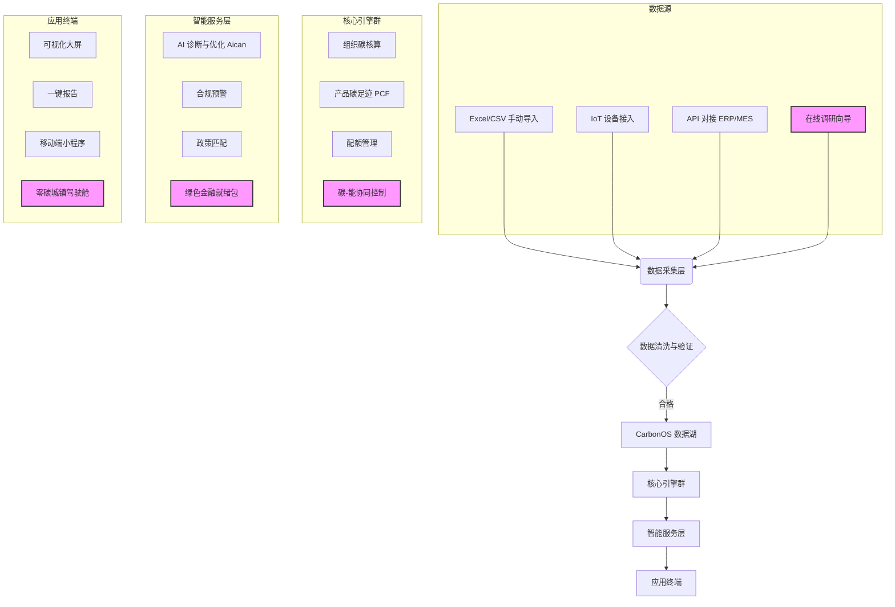
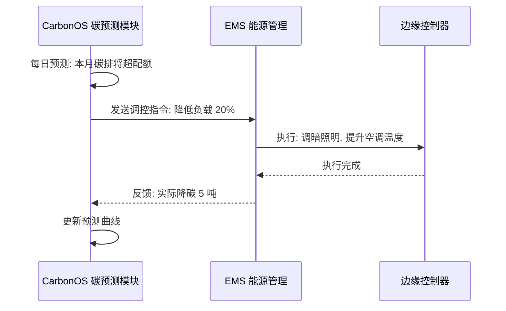
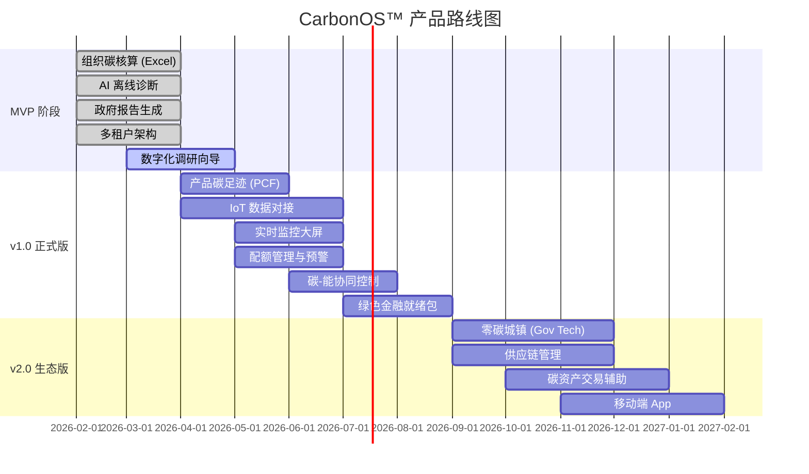

# **创电云 CarbonOS™ 产品需求文档 (PRD)**

**Product Requirements Document**

## **文档元信息**

| 项目 | 内容 |
| :---- | :---- |
| **文档类型** | 产品需求文档 (PRD) |
| **产品名称** | **创电云 CarbonOS™ - 零碳资产与价值创造操作系统** |
| **版本** | **v1.3.1 (实现更新版)** |
| **编写日期** | 2026年2月8日 |
| **负责人** | 产品团队 |
| **目标读者** | 产品经理、设计师、工程师、管理层、销售团队 |
| **文档状态** | **已实现** |

**v1.3.1 更新摘要 (2026-02-08)**：

1. **数字化调研向导**：✅ 已上线
   - 前端：`/diagnosis` Typeform 风格问卷 (framer-motion 动画)
   - 后端：`POST /api/v1/surveys` + `GET /api/v1/surveys/{id}/diagnosis`
   - 数据库：`surveys` 表 (Alembic 迁移 003)
2. **ROI 价值计算器**：✅ 已上线
   - 组件：`ROICalculator.tsx` (首页集成)
   - 计算逻辑：碳税节省 + 绿电收益 + 投资回报期
3. **Feature Flag 多租户分层**：✅ 已实现
   - 后端：`feature_flags.py` (12 功能 × 4 层级)
   - 后台管理：`/admin/feature-flags` 可视化开关矩阵
4. **后台管理页面**：✅ 已上线
   - 调研管理：`/admin/surveys` (表格/搜索/分页/详情弹窗)
   - 功能开关：`/admin/feature-flags` (Toggle Matrix)
5. **微信域名验证**：✅ 已添加验证文件

**v1.3 战略升级内容**（保持不变）：

---

## **1. 产品概述**

### **1.1 产品定位**

**创电云 CarbonOS™** 是面向工业园区、企业和政府的**零碳转型数字基础设施**。它不仅是一个核算工具，更是连接能源数据、工业生产、碳资产管理与绿色金融的底层操作系统。

**核心价值主张 (Value Propositions)：**

| 维度 | 价值 | 描述 |
| :--- | :--- | :--- |
| **合规** | 规避碳风险 | CBAM 应对、配额监控、政府报告自动生成 |
| **降本** | 能源节约 | AI 诊断识别减排机会，碳-能协同控制降低能耗 |
| **增收** | 资产变现 | 绿电/绿证交易、CCER 开发、绿色信贷辅助 |
| **增效** | 数字化升级 | 数据驱动决策，替代手工 Excel 核算 |

### **1.2 目标用户与使用场景 (扩展版)**

| 用户类型 | 职位角色 | 核心需求 | 对应功能模块 | 订阅层级 |
| :---- | :---- | :---- | :---- | :---- |
| **出口企业主** | 外贸部经理 | 应对欧盟 CBAM 碳关税 | 产品碳足迹 (PCF) | **启航版** |
| **能源管理员** | 设备工程师 | 监控能耗、优化设备运行 | 实时监控、AI诊断 | 专业版 |
| **ESG 负责人** | ESG 经理 | 准备 ESG 报告、满足投资者要求 | 报告生成、对标分析 | 专业版 |
| **园区管理者** | 园区总经理 | 降低整体碳排，获取绿色园区补贴 | 多租户管理、政策匹配 | **旗舰版** |
| **财务总监** | CFO | 获取绿色信贷、碳资产变现 | **绿色金融就绪包** | 旗舰版 |
| **政府官员** | 发改委/生态环境局 | 区域能耗双控、零碳城镇建设 | **零碳城镇 (Gov Tech)** | 定制版 |

---

## **2. 产品目标**

### **2.1 业务目标 (修订)**

* **近期 (6个月)**：上线 MVP + 启航版。验证 CBAM 合规场景。**签约 10 家付费客户。**
* **中期 (1年)**：覆盖江苏 50+ 园区。完成 IoT 接入。**ARR 达到 200 万元。** 落地首个绿色信贷辅助案例。
* **长期 (3年)**：成为领先 SaaS 平台。**绿电/碳资产交易撮合佣金收入占比超 30%。**

### **2.2 关键成功指标 (KPIs)**

| 指标类别 | 具体指标 | 目标值 (6个月) | 目标值 (12个月) |
| :---- | :---- | :---- | :---- |
| **用户增长** | 注册租户数 / 付费客户数 | 100 / 10 | 300 / 50 |
| **产品黏性** | 核心功能 MAU (月活) | > 40% | > 60% |
| **业务价值** | ARR (年度经常性收入) | 100 万元 | 200 万元 |
| **增值服务** | 绿色金融/交易撮合收入 | N/A | 50 万元 |

---

## **3. 功能需求**

### **3.1 功能架构与流程图 (v1.3)**

> *粉色高亮为 v1.3 新增模块*

---

### **3.2 核心功能详细说明**

#### **3.2.1 碳核算引擎 (P0)**

* **核心更新**：支持"集团 -> 园区 -> 企业 -> 车间"四级账户体系。
* **范围覆盖**：Scope 1 (直接排放), Scope 2 (间接排放 - 电力/热力), Scope 3 (选填 - 供应链上下游)。

#### **3.2.2 AI 智能诊断 (P0) - Aican 驱动**

* **描述**：基于 RAG (检索增强生成) 技术，脱敏分析企业能耗与碳排数据。
* **机制**：集成 **Aican API (Opus 4.5)** 或 通义千问 作为后端大模型。
* **输出**：
    * 减排机会点识别 (如：高峰时段设备运行优化)。
    * 自动生成《AI 诊断报告》，包含优化建议与投资回报预测。

#### **3.2.3 产品碳足迹 (PCF) 助手 (P1 -> v1.0)**

* **优先级**：**P1 (v1.0 核心功能)**
* **痛点**：出口企业急需计算单个产品碳排放以应对 CBAM。
* **功能描述**：
    * **分摊模型**：基于"产量"、"工时"或"产值"将组织总碳排分摊到具体产品。
    * **BOM 管理**：简版物料清单 (BOM) 碳排计算 (原材料 + 加工过程)。
    * **合规输出**：生成符合 **CBAM 通报格式** 的产品碳足迹报告。

#### **3.2.4 碳配额与履约管理 (P1 -> v1.0)**

* **优先级**：**P1 (针对控排企业)**
* **功能描述**：
    * **配额看板**：可视化展示 *政府发放配额 vs 当前实际排放*。
    * **盈亏测算**：基于当前碳价，计算剩余/超额排放量的资产价值或潜在罚款。
    * **预警机制**：当排放量达到配额的 80%/90% 时触发多通道告警 (邮件/短信/企业微信)。

#### **3.2.5 实时监控大屏 (P1 -> v1.0)**

* **说明**：MVP 阶段使用 T-1 (昨日) 数据；v1.0 IoT 接入后实现实时刷新。
* **交互**：支持大屏投放模式、钻取下钻 (从集团 -> 车间)。

#### **3.2.6 报告生成 (P0)**

* **支持格式**：
    * 政府年度碳核查报告 (MRV)。
    * **CBAM 碳边境调节机制通报**。
    * ESG 报告章节 (碳部分)。
    * **绿色信贷申请辅助报告 (NEW)**。

---

### **3.3 AI 大模型训练服务 (已上线)** ✅

> **页面路径**: `/ai-models`
> **状态**: 已实现并上线

创电云依托万卡 GPU 集群与专业 AI 工程团队，为战略性垂直行业提供从数据治理到模型部署的全链路大模型训练服务。

#### **3.3.1 行业解决方案矩阵**

| 行业 | 模块名称 | 核心能力 | 典型场景 | 关键指标 |
| :--- | :--- | :--- | :--- | :--- |
| **医药** | Pharma AI | 药物分子设计、蛋白质结构预测、临床试验分析 | 新药研发加速、基因组学分析 | 研发周期缩短 70% |
| **金融** | FinTech AI | 实时风险评估、量化交易策略、反欺诈检测 | 智能风控、量化策略 | 风险识别率 99.9% |
| **新能源** | Energy AI | 光伏/风电功率预测、电网负荷调度、V2G优化 | 发电预测、智能调度 | 能效提升 15% |
| **农业育种** | AgriTech AI | 基因组分析、育种方案优化、产量预测 | 智慧育种、精准农业 | 育种效率提升 3x |

#### **3.3.2 服务流程**

1. **需求调研** - 深入理解业务场景与数据现状
2. **方案设计** - 定制化模型架构与训练策略
3. **数据准备** - 数据清洗、标注与特征工程
4. **模型训练** - 大规模分布式训练与调优
5. **评估验证** - 多维度性能测试与效果评估
6. **部署上线** - 生产环境部署与监控运维

#### **3.3.3 核心优势**

| 优势 | 描述 |
| :--- | :--- |
| **数据安全合规** | 等保三级认证、ISO 27001、私有化部署支持 |
| **快速交付能力** | 从需求到模型上线平均 2-4 周 |
| **全链路服务** | 数据治理→模型开发→训练调优→部署运维 |

#### **3.3.4 服务能力数据**

| 指标 | 数值 |
| :--- | :--- |
| 服务企业 | 200+ |
| 模型训练任务 | 5,000+ |
| GPU 集群规模 | 10,000+ |
| 数据处理量 | PB 级 |

---

### **3.4 CarbonOS Brain v1.0 (已上线)** ✅

> **页面路径**: `/dashboard/ai-analysis`
> **状态**: 已实现并上线

CarbonOS Brain 是平台内置的 AI 智算分析引擎，基于时序转换模型（Time-Series Transformer）提供能耗预测与优化建议。

#### **3.4.1 核心功能**

| 功能 | 描述 | 技术实现 |
| :--- | :--- | :--- |
| **能耗预测** | 未来 24 小时能耗趋势预测 (含 95% 置信区间) | Time-Series Transformer |
| **节能潜力识别** | 识别可优化的能耗区间与设备 | 异常检测算法 |
| **一键优化** | AI 自动生成设备调度策略 | 规则引擎 + LLM |
| **异常检测** | 实时识别设备能耗异常 | Anomaly Detection |

#### **3.4.2 输出示例**

- **预测置信度**: 基于过去 12 个月高精度训练集
- **节能潜力**: 识别可优化百分比 (如：夜间基准负荷调整)
- **异常告警**: "B-03 空压机组能耗异常，产生额外能耗 320 kWh"

---

### **3.5 v1.3 规划功能模块**

#### **3.5.1 数字化调研向导 (P1 -> v1.0)** 🆕

* **优先级**：**P1**
* **背景**：传统零碳项目依赖线下 Word 文档调研，效率低、数据难沉淀。
* **功能描述**：
    * **场景选择**：用户首次登录后，选择业务场景（零碳工厂/零碳建筑/零碳园区/零碳城镇）。
    * **问卷向导**：根据场景推送结构化问卷（基于 `打造零碳工厂和零碳产业园的前期调研大纲.docx` 等资料改编）。
    * **自动诊断**：用户填写完毕后，系统自动生成《初步诊断报告》，识别主要排放源与潜在优化点。
    * **销售线索**：诊断报告可设置为"查看完整版需联系销售"，实现获客转化。
* **技术实现**：
    * 前端：Typeform 风格的多步骤表单组件。
    * 后端：独立的 `Survey` 模型，关联 `Tenant`。

| 字段 | 类型 | 说明 |
| --- | --- | --- |
| `id` | UUID | 主键 |
| `tenant_id` | UUID (FK) | 关联租户 |
| `scenario` | Enum | factory / building / park / town |
| `answers` | JSONB | 用户问卷回答 |
| `diagnosis_report_url` | String | AI 生成报告的存储地址 |
| `created_at` | DateTime | 创建时间 |

---

#### **3.5.2 碳-能协同控制 (P1 -> v1.0)** 🆕

* **优先级**：**P1 (旗舰版核心功能)**
* **背景**：传统 EMS (能源管理系统) 与 Carbon (碳管理) 是独立系统，无法实现闭环控制。
* **功能描述**：
    * **碳预算触发**：当"本月累计碳排放"预测将超过配额时，系统自动触发能源调度策略。
    * **控制动作**：
        * 降低非关键负载功耗 (如：照明、空调)。
        * 切换储能供电 (优先使用绿电)。
        * 调整生产排程 (将高耗能任务移至低碳时段，如光伏发电高峰期)。
    * **效果反馈**：实时显示"本次调控减排 X 吨 CO₂"。
* **技术实现**：
    * 需与 EMS 系统进行 API 对接（创电云自有 EMS 或第三方 OpenADR 协议）。
    * 控制策略引擎基于规则 + AI 推荐。

---

#### **3.5.3 绿色金融就绪包 (P2 -> v1.0)** 🆕

* **优先级**：**P2 (旗舰版增值功能)**
* **背景**：企业申请绿色信贷时，银行需要第三方碳信排查报告，但市面上此类服务昂贵。
* **功能描述**：
    * **数据整合**：自动汇总企业过去12个月的能耗、碳排放、减排措施。
    * **报告模板**：内置多家银行（如建设银行、兴业银行）绿色信贷审核标准的报告模板。
    * **一键生成**：生成《企业碳信排查报告》PDF，可直接递交银行。
    * **资产估值**：基于企业碳数据，估算其"绿色资产"价值（如：储能/光伏未来收益折现）。
* **商业模式**：
    * 旗舰版用户每年可免费生成 2 份报告。
    * 额外报告按 ¥ 2,000 / 份 收费，或抽取银行放款金额 0.5% 佣金（灵活选择）。

---

#### **3.5.4 零碳城镇 (Gov Tech) 模块 (P2 -> v2.0)** 🆕

* **优先级**：**P2 (针对政府客户的定制模块)**
* **背景**：地方政府推进"零碳城镇"建设，需要区域级碳管理与能耗双控工具。
* **功能描述**：
    * **区域碳账户**：汇总辖区内所有企业/家庭的碳积分，形成"碳画像"。
    * **双控驾驶舱**：实时监控区域能耗强度 (万元GDP能耗) 和总量，提供红线预警。
    * **招商引资看板**：展示区域绿色基础设施（光伏容量、充电桩数量），吸引 ESG 敏感型企业。
    * **政策模拟器**：模拟不同政策（如碳税、补贴）对区域碳排的影响。
* **部署模式**：
    * 建议**私有化部署**或**专属租户**，保障政府数据安全。

---

### **3.4 功能优先级矩阵 (v1.3)**

| 功能模块 | 优先级 | MVP | v1.0 | v2.0 | 订阅层级 | 说明 |
| :---- | :---- | :--- | :--- | :--- | :---- | :---- |
| 组织碳核算 | P0 | ✅ | ✅ | ✅ | Essential+ | 基础底座 |
| AI 智能诊断 (Aican) | P0 | ✅ | ✅ | ✅ | Pro+ | 核心差异化 |
| 报告生成 (政府/CBAM) | P0 | ✅ | ✅ | ✅ | Essential+ | 刚需 |
| 多级租户管理 | P0 | ✅ | ✅ | ✅ | All | 架构必须 |
| **数字化调研向导** | **P1** | ❌ | ✅ | ✅ | Essential+ | **获客利器** |
| **产品碳足迹 (PCF)** | **P1** | ❌ | ✅ | ✅ | Pro+ | **CBAM 核心** |
| **配额管理** | **P1** | ❌ | ✅ | ✅ | Pro+ | 控排企业刚需 |
| 实时监控 (IoT) | P1 | ❌ | ✅ | ✅ | Pro+ | 依赖 IoT |
| **碳-能协同控制** | **P1** | ❌ | ✅ | ✅ | Enterprise | **旗舰版核心** |
| **绿色金融就绪包** | **P2** | ❌ | ✅ | ✅ | Enterprise | 增值服务 |
| **零碳城镇 (Gov Tech)** | **P2** | ❌ | ❌ | ✅ | Custom | 政府定制 |
| 供应链管理 | P2 | ❌ | ❌ | ✅ | Enterprise | 扩展生态 |
| 碳资产交易辅助 | P2 | ❌ | ❌ | ✅ | Enterprise | 商业闭环 |

---

## **4. 零碳场景细分 (New Section)**

CarbonOS 针对不同场景提供差异化功能组合：

### **4.1 零碳工厂 (Factory)**

| 目标客户 | 核心痛点 | CarbonOS 解决方案 | 推荐订阅 |
| :--- | :--- | :--- | :--- |
| 出口制造企业 | CBAM 碳关税合规 | 产品碳足迹 (PCF) + CBAM 报告 | 启航版/专业版 |
| 高耗能企业 | 能耗成本高、配额超标风险 | 碳-能协同控制 + AI诊断 | 旗舰版 |

### **4.2 零碳建筑 (Building)**

| 目标客户 | 核心痛点 | CarbonOS 解决方案 | 推荐订阅 |
| :--- | :--- | :--- | :--- |
| 商业地产/物业 | LEED/WELL 认证数据准备 | 组织碳核算 + ESG报告 | 专业版 |
| 公共建筑 (学校/医院) | 能效提升、政府考核 | 实时监控 + 对标分析 | 专业版 |

### **4.3 零碳园区 (Park)**

| 目标客户 | 核心痛点 | CarbonOS 解决方案 | 推荐订阅 |
| :--- | :--- | :--- | :--- |
| 园区运营方 | 招商引资、绿色配额 | 多租户管理 + 源网荷储协同 | 旗舰版 |
| 开发区管委会 | 能耗双控达标 | 双控驾驶舱 + 政策匹配 | 旗舰版/定制 |

### **4.4 零碳城镇 (Town)**

| 目标客户 | 核心痛点 | CarbonOS 解决方案 | 推荐订阅 |
| :--- | :--- | :--- | :--- |
| 地方政府 (镇/区) | 区域碳中和考核、绿色GDP | 零碳城镇驾驶舱 + 区域碳账户 | 定制版 |

---

## **5. 非功能需求**

### **5.1 安全与合规**

* **数据主权**：中国境内服务器部署（阿里云/华为云）。
* **数据留痕**：关键碳数据修改强制留痕（操作日志），满足未来碳交易审计。
* **信创适配**：支持麒麟/统信操作系统，达梦/OceanBase 数据库。
* **隐私保护**：AI 诊断使用脱敏数据，不上传原始敏感信息。

### **5.2 性能要求**

| 指标 | 目标值 |
| --- | --- |
| API 响应时间 (P95) | < 500ms |
| 大屏数据刷新频率 (IoT 场景) | < 5 秒 |
| 并发租户支持 | 1000+ |
| 数据存储 (单租户/年) | 10GB |

### **5.3 扩展性与集成**

* **IoT 协议**：MQTT, Modbus TCP, OPC-UA (通过边缘网关)。
* **企业应用集成**：ERP (SAP/金蝶/用友), MES, 飞书/企业微信告警。
* **开放 API**：提供 RESTful API，允许第三方系统查询碳数据。

---

## **6. SaaS 商业模式与定价 (New Section)**

### **6.1 订阅分层 (Tiered Subscription)**

| 订阅版本 | **CarbonOS 启航版 (Essential)** | **CarbonOS 专业版 (Pro)** | **CarbonOS 旗舰版 (Enterprise)** |
| :--- | :--- | :--- | :--- |
| **目标客户** | 小型出口企业 / 单一工厂 | 中型制造企业 / 集团分厂 | 工业园区 / 大型集团 / 政府客户 |
| **核心痛点** | 应对 CBAM 合规 | 降本增效、全面盘查 | 资产管理、区域监管、定制化 |
| **年度订阅费** | **¥ 9,800** | **¥ 49,800** | **¥ 200,000+** (或私有化) |
| **包含租户层级** | 1个 (单层级) | 1个 (支持多部门/车间) | 多层级 (Group -> Factory) |
| **核心功能** | • 组织碳核算 (Excel导入) • CBAM报告 (1份/月) • 基础看板 • 数字化调研向导 | • **AI 智能诊断** • **IoT 数据接入** (10点) • 产品碳足迹 (PCF) • 配额管理与预警 • 多类型报告 | • **碳-能协同控制** • **绿色金融就绪包** (2份/年) • 无限 IoT 接入 • 供应链管理 • 专属客户经理 |
| **限制** | 手动录入，无IoT | 10个IoT接入点 | 无限制 |
| **支持** | 在线文档/工单 | 工单 + 远程培训 | 专属客户经理 + 现场实施 |

### **6.2 增值服务 (Add-ons)**

| 服务名称 | 价格 | 适用场景 |
| :--- | :--- | :--- |
| AI 深度诊断报告 | ¥ 2,000 / 份 | 需要更详尽的优化建议 |
| 供应链协同账号 | ¥ 5,000 / 10个供应商 | 允许供应商填报上游碳数据 |
| 额外 IoT 接入点 | ¥ 500 / 设备 / 年 | 超出套餐限制的设备接入 |
| 绿色金融报告 (额外) | ¥ 2,000 / 份 | 额外的银行碳信排查报告 |

### **6.3 资产分润模式 (Commission Model)**

对于**"生态资源变现"**业务，采用**佣金模式**：

| 业务类型 | 佣金比例 | 说明 |
| :--- | :--- | :--- |
| 绿电/绿证交易撮合 | 1% - 3% | 平台撮合买卖双方，抽取交易额佣金 |
| 储能/VPP 辅助服务收益 | 10% - 20% | 基于聚合调频调峰收益分成 |
| CCER 项目开发 | 30% - 50% | "前期免费，落地分成"模式 |
| 绿色信贷撮合 | 0.5% - 1% | 基于银行放款金额抽取 (可选) |

---

## **7. 项目路线图 (Roadmap)**

### **7.1 时间线**

### **7.2 里程碑**

| 阶段 | 时间 | 核心目标 | 关键交付 |
| :--- | :--- | :--- | :--- |
| **MVP** | 2026年4月 | 跑通数据流，验证诊断价值 | 组织核算 + AI 诊断 + 政府报告 |
| **v1.0** | 2026年8月 | 解决 CBAM 痛点，提升客单价 | PCF + IoT + 碳-能协同 |
| **v2.0** | 2027年1月 | 构建生态，碳资产交易闭环 | 供应链 + 零碳城镇 + 移动端 |

---

## **8. 附录**

### **8.1 术语表**

| 术语 | 全称 | 解释 |
| :--- | :--- | :--- |
| CBAM | Carbon Border Adjustment Mechanism | 欧盟碳边境调节机制（碳关税） |
| PCF | Product Carbon Footprint | 产品碳足迹 |
| CCER | China Certified Emission Reduction | 中国核证自愿减排量 |
| LCA | Life Cycle Assessment | 全生命周期评估 |
| MRV | Monitoring, Reporting and Verification | 监测、报告与核查 |
| ESG | Environmental, Social and Governance | 环境、社会和治理 |
| VPP | Virtual Power Plant | 虚拟电厂 |
| OpenADR | Open Automated Demand Response | 开放自动需求响应协议 |

### **8.2 参考文档**

* `苏州创电云官网内容需求文档.md`
* `CarbonOS_Business_Proposal.md` (本次战略提案)
* `打造零碳工厂和零碳产业园的前期调研大纲.docx`
* `打造"零碳镇"的前期调研大纲.docx`
* `关于生态资源变现主要路径的相关建议2026.docx`

---

**©2026 苏州创电云科技有限公司 - 保密文件**
